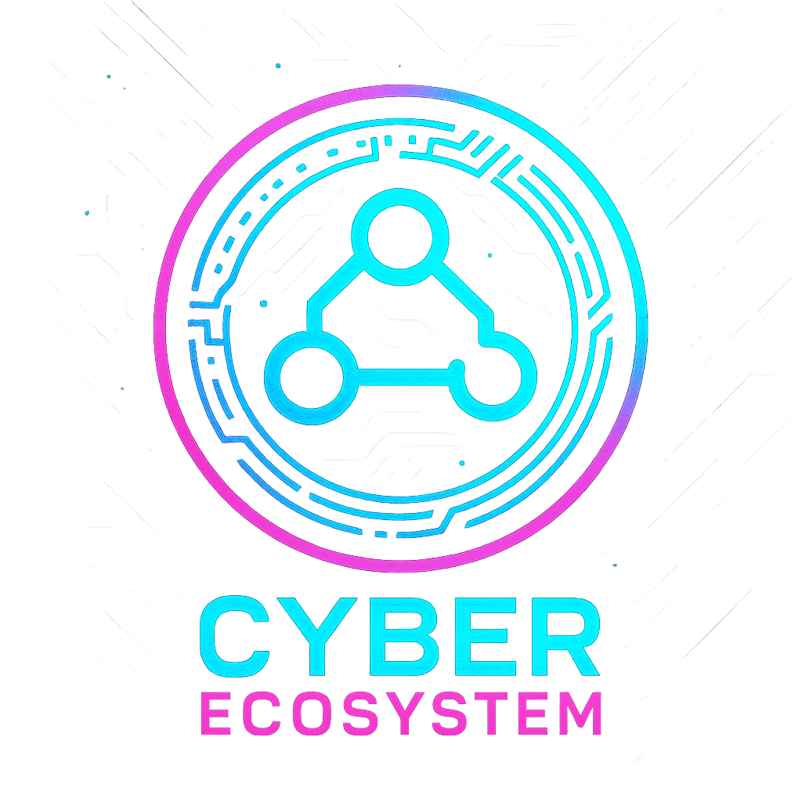

# Cyber Ecosystem Admin



Cyber Ecosystem Admin is a modern, extensible admin dashboard template built with Next.js, TypeScript, and Ant Design. It provides a robust foundation for building enterprise-level admin panels, management systems, and internal tools.

## Overview

This project is designed to help developers quickly build modern admin interfaces with the following highlights:

- 🚀 Modern tech stack with Next.js 15+ and TypeScript
- 📦 Out-of-the-box support for OpenAPI code generation
- 🎯 MSW for API mocking during development
- 🔐 Built-in authentication and authorization
- 🌓 Light/Dark theme support
- 📱 Responsive design for various screen sizes

## Features

- ⚡ Built with [Next.js](https://nextjs.org/) and [TypeScript](https://www.typescriptlang.org/)
- 🎨 UI powered by [Ant Design](https://ant.design/)
- 🌍 Internationalization (i18n) support
- 🧩 Modular architecture with providers for themes, state, and data fetching
- 🧪 Integrated testing with [Vitest](https://vitest.dev/) and [Playwright](https://playwright.dev/)
- 🛡️ API mocking and OpenAPI integration
- 🏗️ Easy customization and extension

## Getting Started

### Prerequisites
- [Node.js](https://nodejs.org/) >= 18.x
- [pnpm](https://pnpm.io/) (recommended)

### Installation

```bash
pnpm install
```

### Development

```bash
pnpm dev
```

### Build

```bash
pnpm build
```

### Lint & Format

```bash
pnpm lint
```

### Test

```bash
pnpm test
```

## Project Structure

```
cyber-ecosystem-admin/
├── src/                    # Main application source code
│   ├── app/               # Next.js app directory
│   │   ├── [locale]/      # Internationalized routes
│   │   └── layout.tsx     # Root layout
│   ├── components/        # Reusable UI components
│   ├── providers/         # Context providers
│   │   ├── antd.provider/ # Ant Design configuration
│   │   ├── themes.provider# Theme management
│   │   └── ...           # Other providers
│   ├── services/         # API integration
│   │   ├── clients/      # API clients
│   │   ├── mocks/        # MSW mock handlers
│   │   └── models/       # Data models
│   ├── store/           # State management
│   └── styles/          # Global styles
├── openapi/             # OpenAPI specifications
├── messages/            # i18n translation files
├── docs/               # Documentation
├── public/             # Static assets
└── scripts/            # Utility scripts
```

### Key Directories

- `src/app/`: Next.js 13+ app directory structure with layouts and pages
- `src/components/`: Reusable UI components with a focus on modularity
- `src/providers/`: Various context providers for theming, state, and configuration
- `src/services/`: API integration layer with OpenAPI-generated clients and mocks
- `src/store/`: State management using Jotai for atomic state

## Internationalization

This project supports multiple languages. Translation files are located in the `messages/` directory.

## License

[MIT](LICENSE)
